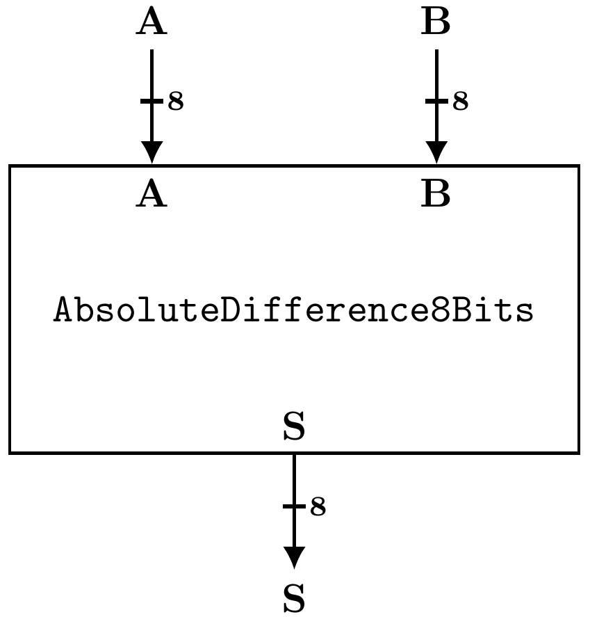
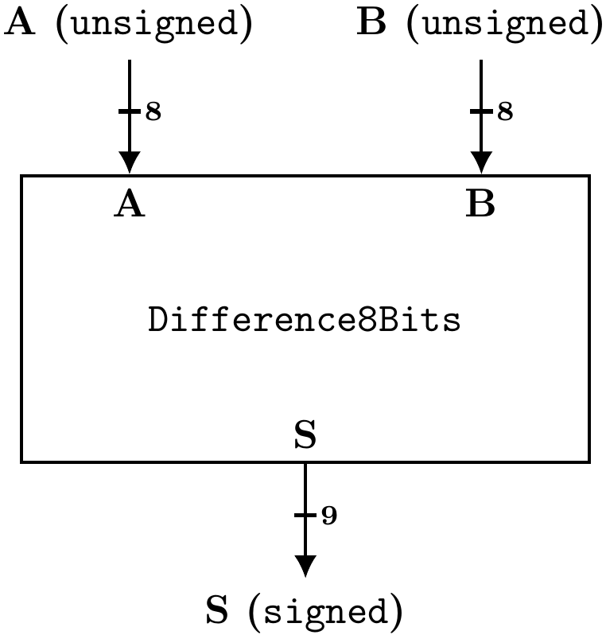
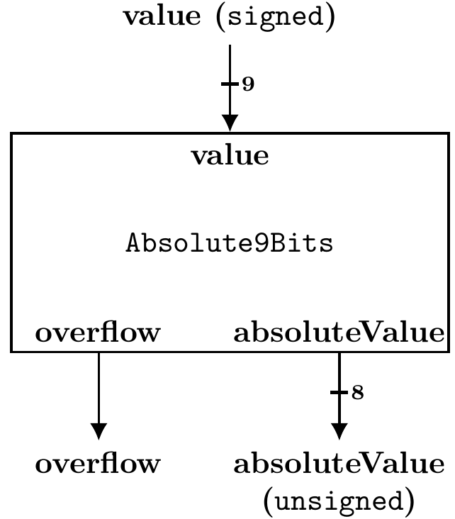

# Exercício 2: Circuito "AbsoluteDifference" em VHDL

Neste segundo exercício você usuará a biblioteca numeric_std para implementar uma arquitetura que calcula, de maneira combinacional, a diferença absoluta (absolute difference) entre dois números de 8 bits sem sinal (denotados por A e B). O resultado (S) será um valor de 8 bits sem sinal, conforme a equação abaixo:

`S = | A - B|` 

A figura que segue apresenta uma visão das interfaces do circuito:

Por restrições de projeto, as interfaces de entrada e saída de `AbsoluteDifference8Bits` devem usar o tipo `std_logic_vector`.

Esta inferface já está pronta e disponível, no arquivo `AbsoluteDifferences.vhdl`. Você não deve alterar a declaração da entidade.

A arquitetura deste circuito deve ser feita estruturalmente a partir de dois outros circuitos combinacionais. Um deles fará a subtração (`difference`) entre A e B, e o outro fará o cálculo do valor absoluto (`absolute`).

A figura abaixo ilustra a entidade "Difference8Bits":

Já a figura abaixo ilustra a entidade "Absolute9Bits":

Ambos também já possuem uma descrição inicial da entidade, nos arquivos `Difference8Bits.vhdl` e `Absolute9Bits.vhdl`, respectivamente. Nos dois casos também não se deve modificar a interface. Note que as interfaces disponíveis já descrevem uma semântica para os valores de entrada e saída, através dos tipos signed e unsigned. Além disso, percebam que o módulo `Absolute9Bits` possui uma saída de `overflow`. 

**Sua primeira tarefa** neste exercício será a implementação dos módulos `Difference8Bits` e `Absolute9Bits`. Para isso você deve utilizar a biblioteca `numeric_std` e suas funções aritméticas. Consulte o arquivo VHDL da biblioteca numeric_std disponível [aqui](https://github.com/ghdl/ghdl/blob/master/libraries/ieee/numeric_std.vhdl). Assuma que alguma versão anterior ao VHDL-2008 será utilizada (isso significa que o vhdl disponibilizado no link será utilizado). 

**Sua segunda tarefa** neste exercício será a implementação do módulo "AbsoluteDifference8Bits" de maneira estrutural. Ou seja, espera-se que você instancie um módulo "Difference8Bits" e um módulo "Absolute9Bits". Além disso, é possível que sejam necessárias algumas conversões de tipo, estudadas na aula 3P. Finalmente, busque alguma solução para o sinal overflow que não será utilizado na arquitetura top-level, i.e., AbsoluteDifference8Bits (dica: os conteúdos extras adicionados nos tópicos das aulas práticas podem ajudar). 

Toda a descrição deve ser feita nestes três arquivos VHDL. Você não deve descrever outras entidades e/ou outras arquiteturas.

Alguns detalhes
Crie as instâncias necessárias por entidade; Não declare componentes; 
Faça sempre mapeamento nominal; Não use mapeamento posicional; 
Mantenha os nomes das arquiteturas e implemente nas arquiteturas já existentes; Não modifique o nome das arquiteturas e também não crie novas arquiteturas;
Mantenha os nomes das entidades e suas interfaces; Não modifique o nome das entidades e não modifique as interfaces, ou seja, não adicione ou remova sinais de entrada/saída;
Conceitos estudados
Uso de array em VHDL através de std_logic_vector;
Biblioteca numeric_std;
Tipos signed e unsigned, conversão de tipos;
Funções aritméticas;
Instanciação por entidade;
Mapeamento nominal (named mapping/association);