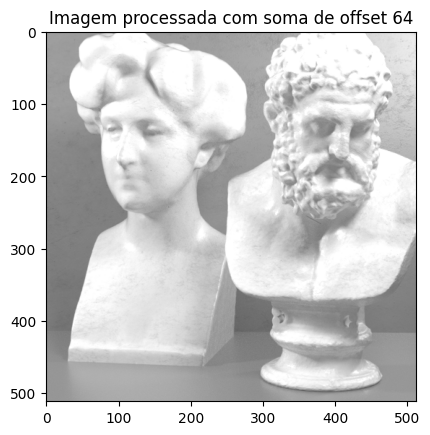
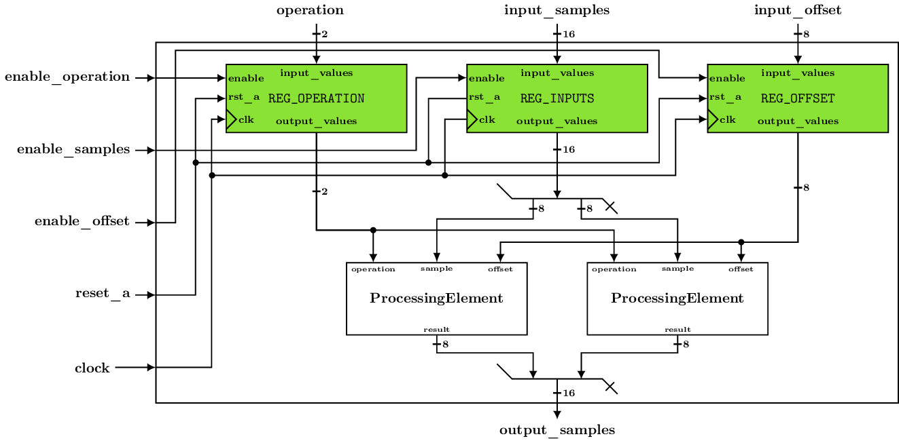

# Um processador de imagens simples com 4 modos de operação
Neste quarto exercício prático vamos explorar um sistema digital mais complexo do que os que trabalhamos até agora. Trabalharemos com um processador de imagens simples, capaz de 4 operações básicas:

**PASSTHROUGH**: Não aplica nenhuma operação nas amostras de uma imagem; 

No final, a imagem gerada após o processamento de todas as amostras será igual a imagem original. 
Por exemplo, se a imagem abaixo, com apenas 1 canal de cor (média de 3 canais) for processada, teremos como saída a mesma imagem:


**THRESHOLD**: Aplica uma limiarização nas amostras de uma imagem; 

Na limiarização, as amostra de saída podem ter apenas **2 valores** de acordo com o número de bits por amostra.
- O valor máxim
- O valor mínimo  

Normalmente as imagens possuem `8 bits` por amostra. Assim, cada amostra processada será ou `0` ou `255`, de acordo com o valor de entrada. Se o valor de entrada for:
- **< 128 (metade do intervalo)**, a saída será `0` (*equivalente à cor preta*). 
- **>= 128**, a saída será `255` (*equivalente a cor branca*). 

Por exemplo, se a imagem apresentada na operação `PASSTHROUGHT` for processada por essa operação, a imagem de saída será a seguinte: 


**ADD_OFFSET**: Adiciona um valor de offset nas amostras de uma imagem. 

O efeito prático de tal operação é:
- O aumento no brilho da imagem. 
  
Além disso, nessa operação, após a soma deverá ser feita uma clipagem (`clipping`) do valor, para garantir que após a soma as amostras continuem  no intervalo permitido para as amostras. Ou seja, após a soma o valor máximo de uma amostra de `N bits` deve continuar `2N-1`. Abaixo há um exemplo de imagem de entrada e o resultado da aplicação da soma de offset 64:

 


**SUB_OFFSET**: Subtrai um valor de offset nas amostras de uma imagem. 

O efeito prático de tal operação é a `redução do brilho` da imagem. Além disso, nesta operação também deve ser feita a `clipagem` do valor para garantir que nao sejam obtidas amostras negativas. Em geral, as amostras de uma imagem são `números sem sinal`, portanto não podem ser representados `valores negativos`. 

Abaixo há um exemplo de imagem de entrada e o resultado da aplicação da subtração de offset 64:

 


## Implementação do sistema digital: `ProcessingElement`
Inicialmente, foi criado um sistema digital puramente combinacional para fazer o processamento de acordo com as operações listadas acima. O nome de tal sistema digital é `ProcessingElement` (que traduz para "elemento de processamento"), e as interfaces são apresentadas abaixo:


Há `3 entradas` e apenas `1 saída`. 
A entrada `operation` recebe `2 bits` sinalizando qual a operação a ser realizada pelo `ProcessingElement`, conforme a tabela abaixo:

### Operation codes

|Operation	 | Binary Code
|------------|--------
|PASSTHROUGH |	00
|THRESHOLD	 | 01
|ADD_OFFSET	 | 10
|SUB_OFFSET	 | 11

A entidade `ProcessingElement` foi descrita para ser **parametrizável** para o **número de bits de cada amostra (`N`)*, assim uma amostra pode ter `8`, `10`, `12` ou `quantos bits forem necessários`. Como o mais comum é `8 bits`, 8 foi usado como valor padrão para `N`. 

As outras duas entradas são `sample` e `offset`, ambas com `N bits`. 

As entradas:
- `sample` representa a amostra que será processada
- `offset` representa o valor de offset a ser somado ou subtraído, caso operation seja ADD_OFFSET ou SUB_OFFSET, respectivamente. 

A saída: 
- `result` apresenta o resultado da operação sinalizada em `operation` sobre o valor de `sample`. 

Abaixo há uma possível implementação para o `ProcessingElement`:


> Note que na implementação acima é usado um `somador/subtrator` configurável, economizando assim recursos (uma vez que nunca será feita a soma e a subtração no mesmo ciclo). Este `somador/subtrator` configurável opera sobre números com sinal (`signed`), gerando também números `signed`. Porém, as entradas `sample` e `offset` são sempre números sem sinal (`unsigned`). Note também o aumento no número de bits antes da operação e busque compreender o motivo para tal aumento. Além disso, na proposta acima, tanto o `somador/subtrator` configurável quanto o módulo responsável pelo `clipping` (Clip) estão em outro módulo, chamado de `add_sub_clip`, que agrega ambos. As entradas e a saída de `add_sub_clip` são valores `unsigned` com `N bits`. 

### Há duas limitações neste circuito proposto:

1. Não há registradores (uma vez que o circuito é completamente combinacional). Isso faz com que qualquer modificação nas entradas gere propagação para a saída;
2. Apenas uma amostra de `N bits` é processada por vez. As imagens de exemplo acima possuem cerca de 262 mil amostras (512x512=262144, para ser exato). Se formos processar amostras em um vídeo, teremos restrições de tempo de processamento. Por exemplo, considerando 30 fps (quadros por segundo), cada imagem deve ser processada em apenas 33ms. Se nosso vídeo for UltraHD (resolução 3840x2160 amostras), teremos apenas cerca de 4ns para processar cada amostra sequencialmente. 

### Implementação do sistema digital: `SimpleImageProcessor`
Agora vamos definir um sistema digital mais completo, chamado de `SimpleImageProcessor`(processador simples de imagens). Embora tal sistema digital ainda não possuirá um bloco de controle, já vamos adicionar alguns registradores nas entradas. 

Além disso, faremos nossa descrição parametrizável (genérica) tanto para o número de bits das amostras (`N`), quanto para o número de amostras que serão processadas em paralelo (`P`). Afinal, queremos explorar a capacidade de paralelização em hardware. 
> Se processaremos as amostras em paralelo, precisamos ter entradas e saídas de amostras em paralelo. Conseguimos isso ao criar um vetor de entrada agrupando as amostras, tal que nosso vetor contenha `NxP bits` (N bits por amostra e P amostras em paralelo).

A figura abaixo ilustra a entidade `SimpleImageProcessor`:


Como vamos usar registradores, teremos um sinal de relógio (`clock`). Adicionamos também um `reset` assíncrono ativo **alto** (ou seja, o reset é feito quanto o valor do sinal reset for '1'), chamado de `reset_a`. Além disso, teremos um sinal de `enable` para carregar cada uma das entradas (`operation`, `input_samples` e `input_offset`) em um registrador para cada um. 

Faremos isso pois podemos manter, por exemplo, uma operação e um valor de offset fixos, enquanto mudamos os valores da entrada. Isso seria uma operação comum para processarmos uma imagem completa. Assim, para implementar o `SimpleImageProcessor`, precisamos de:
- um registrador para manter a operação
- um registrador para manter as amostras que serão processadas
- um registrador para manter o `offset`.
- `P` instâncias de `ProcessingElements`. 

Ou seja, para cada amostra processada em paralelo, teremos uma instância de `ProcessingElement`.

A figura abaixo apresenta um exemplo de como deve ser a implementação da arquitetura do `SimpleImageProcessor` para processar 2 amostras de 8 bits. 

Ou seja, **P=2** e **N=8**. Consequentemente, em tal concretização de nosso circuito:
- Tanto a entrada `input_samples` quanto a saída `output_samples` terão `16 bits` (*PxN=2x8=16*).
- Enquanto nossa entrada `input_offset` terá `8 bits` (*N=8*), afinal o mesmo valor de `offset` é adicionado a todas as `P` amostras processadas em paralelo. 



> Note, abaixo do registrador `REG_INPUTS` como as amostras são desagrupadas antes de serem realmente processadas por duas instâncias de `ProcessingElement`. 
> 
> Note também, acima de `output_samples`, como elas são novamente agrupadas na mesma ordem que foram recebidas. Tal coerência no agrupamento é importante para garantir que outros sistemas que se comunicam com o `SimpleImageProcessor` funcionem corretamente. 

## O que você fará neste exercício
Afinal de contas, o que será feito neste exercício? Bom, embora os diagramas fornecidos acima ilustrem as arquiteturas, você terá o trabalho de terminar algumas das implementações. Para isso, o exercício estará dividido em 4 partes:

1. **Correção da implementação do registrador de N bits (1 ponto)**. 
    
    *Há dois pequenos errros na implementação* do registrador e você deve corrigi-los. Use as mensagens de erro do testbench para encontrar os erros na funcionalidade esperada;
2. **Correção da implementação de 'add_sub_clip' (1.5 pontos)**; 
   
   *Aqui também há erros na implementação* que devem ser corrigidos. 
3. **Finalização da implementação do ProcessingElement (2.5 pontos)**; 
   
   A arquitetura mixed de `ProcessingElement` está quase finalizada. Falta apenas completar o `process` que define o que será colocado nas saídas e a configuração da operação de soma/subtração (através do sinal add, que é entrada de 'add_sub_clip');
4. **Finalização da implementação do SimpleImageProcessor (5 pontos)**;
   
    A descrição do `SimpleImageProcessor` que você tem não contém as instanciação dos `ProcessingElements`. Logo, você deverá implementar a parte do código que falta para fazer a alocação. 
    >Note que será necessário utilizar algum comando `generate` para permitir a instanciação de `P ProcessingElements`. 

> Atenção: Para que a correção funcione em partes, você deverá editar o arquivo "partes_a_corrigir.json", que está disponível junto com código VHDL. Através desse arquivo você irá configurar quais partes da correção serão executadas. O arquivo tem um formato como segue:
```json
{

  "parte1": { "corrigir" : true },

  "parte2": { "corrigir" : false },

  "parte3": { "corrigir" : false },

  "parte4": { "corrigir" : false }

}
```


Para que a correção de uma parte seja feita, você deverá marcá-la como true. A nota final só será completa se todas as partes forem marcadas como true. 

**Sugestão**: Vá habilitando as partes uma por uma. Ou seja, após resolver a parte 1, marque a parte 2 como true e mantenha a parte 1 como true. Assim ficará mais simples de verificar as mensagens de erro dos testbenches que são executados para fazer as verificações sobre as arquiteturas deste exercćio. Ao final, quando passar a marcar a parte 4 como true, as anteriores também deverão estar como true. Logo, a nota completa será calculada. 

### Arquivos VHDL fornecidos
Para este exercício, você terá acesso ao arquivo `JSON` `partes_a_corrigir.json` e aos seguintes arquivos VHDL:

- **register.vhdl**: contém a entidade `registerNBits` e sua arquitetura; A **arquitetura está com dois erros** e você deve corrigí-los (parte 1 do exercício);
  
- **clip.vhdl**: contém a entidade `clip` e sua arquitetura; 
- **add_sub_clip.vhdl**: contém a entidade add_sub_clip e sua arquitetura; A arquitetura está com alguns erros que devem ser corrigidos (parte 2 do exercício);
- **image_operations.vhdl**: contém a descrição do pacote image_operations. Este pacote contém a definição to tipo operation_type, que modela as operações disponíveis para o processamento de imagens (listadas no início do exercício) e seus valores binários (listados na tabela "Operation Codes"). Além disso, há algumas funções úteis que vocês podem utilizar no exercício;
- **processing_element.vhdl**: contém a entidade `ProcessingElement` e sua arquitetura. A arquitetura está incompleta, faltando apenas a implementação do case dentro do process (que deve ser feita como parte 3 do exercício). 
  > Note que este módulo digital é puramente combinacional, não possuindo portanto clock e elementos de memória (registradores/latches, etc);
- **simple_image_processor.vhdl**:  contém a entidade `SimpleImageProcessor` e sua arquitetura estrutural. Na arquitetura já estão instânciados os registradores (
`REG_OFFSET`, `REG_OPERATION` e `REG_INPUTS`. Você deverá implementar a instanciação dos `ProcessingElements` necessários: serão `P` instâncias, uma vez que este módulo é parametrizável tanto em termos de número de bits por amostra (N) quanto no número de amostras processadas em paralelo (P). A implementação da instanciação, usando generate, é a parte 4 do exercício. 

> PS: O módulo SimpleImageProcessor será testado através das 4 operações em variações de P e N. Assim, é necessário manter os generics P e N e deixar a descrição parametrizável. 